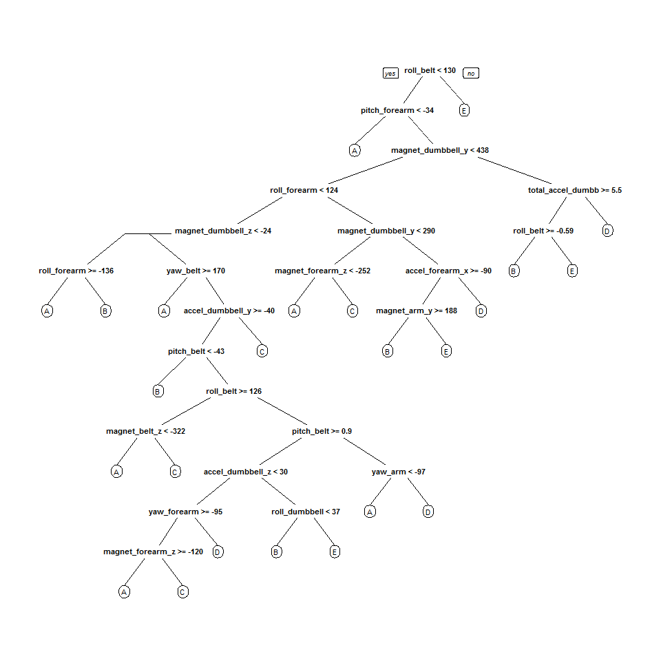

# Coursera Practical Machine Learning - Course Project
by romkhot  

## 1. Introduction  
Using devices such as Jawbone Up, Nike FuelBand, and Fitbit it is now possible to collect a large amount of data about personal activity relatively inexpensively. These type of devices are part of the quantified self movement - a group of enthusiasts who take measurements about themselves regularly to improve their health, to find patterns in their behavior, or because they are tech geeks. One thing that people regularly do is quantify how much of a particular activity they do, but they rarely quantify how well they do it. In this project, your goal will be to use data from accelerometers on the belt, forearm, arm, and dumbell of 6 participants. They were asked to perform barbell lifts correctly and incorrectly in 5 different ways. More information is available from the website here: http://groupware.les.inf.puc-rio.br/har (see the section on the Weight Lifting Exercise Dataset).  

In this project, we will use data from accelerometers of 6 participants to predict the manner in which they did the exercise.  

## 2. Data Preprocessing

### 2.1. Load necessary packages

```r
setwd("D:/DOCs/COURSERA/8 - Practical Machine Learning/CP/Coursera-Machine-Learning-CP")
library(caret)
library(rpart)
library(rpart.plot)
library(randomForest)
library(corrplot)
```
### 2.2. Download the Data 

```r
train_file <- "./data/pml-training.csv"
test_file  <- "./data/pml-testing.csv"
if (!file.exists(train_file)) {
  download.file( url = "https://d396qusza40orc.cloudfront.net/predmachlearn/pml-training.csv",
                 destfile = train_file )
}
if (!file.exists(test_file)) {
  download.file( url = "https://d396qusza40orc.cloudfront.net/predmachlearn/pml-testing.csv", 
                 destfile = test_file )
}
```
### 2.3. Getting the raw data
After downloading the data from the data source, we can read the two csv files into two data frames.  

```r
train_raw <- read.csv(train_file)
test_raw <- read.csv(test_file)
dim(train_raw)
```

```
## [1] 19622   160
```

```r
dim(test_raw)
```

```
## [1]  20 160
```

```r
#head(train_raw)
#head(test_raw)
```
Each data set contains 160 variables, the "classe" variable of training set is the outcome to predict. 
Training data set contains 19622 observations, testing data set contains 20 observations. 

### 2.4. Data Cleansing
Clean up the data and remove observations with inappropriate values.

```r
#number of complete cases:
sum(complete.cases(train_raw))
```

```
## [1] 406
```
First, let's remove the columns containing NA values.

```r
train_raw <- train_raw[, colSums(is.na(train_raw)) == 0] 
test_raw <- test_raw[, colSums(is.na(test_raw)) == 0] 
```
Next, remove some columns (such as "timestamp", "window"") that do not contribute to the measurements.

```r
#Remember the "classe" variable: 
classe <- train_raw$classe
#Clean up train set:
train_remove <- grepl("^X|timestamp|window", names(train_raw))
train_raw <- train_raw[, !train_remove]
train_clean <- train_raw[, sapply(train_raw, is.numeric)]
train_clean$classe <- classe
#Clean up test set:
test_remove <- grepl("^X|timestamp|window", names(test_raw))
test_raw <- test_raw[, !test_remove]
test_clean <- test_raw[, sapply(test_raw, is.numeric)]
```
After these transformations the clean training set contains 19622 observations and 53 variables, the testing set contains 20 observations and 53 variables.

### 2.5. Splitting the training set
We will split the cleaned training set into a pure training data set (70%) and a validation data set (30%). We will use the validation data set to conduct cross validation in future steps.  

```r
set.seed(3377) # For reproducibility
in_train <- createDataPartition(train_clean$classe, p=0.70, list=F)
train_data <- train_clean[in_train, ]
test_data <- train_clean[-in_train, ]
```

## 3. Data Modeling
We will use the **Random Forest** algorithm as a predictive model for activity recognition. It automatically selects important variables and is robust to correlated covariates & outliers in general. The **5-fold cross validation** will be used when applying the algorithm.  

```r
control_rf <- trainControl(method="cv", 5)
model_rf <- train( classe ~ ., data = train_data, method = "rf", trControl = control_rf, ntree = 250)
model_rf
```

```
## Random Forest 
## 
## 13737 samples
##    52 predictor
##     5 classes: 'A', 'B', 'C', 'D', 'E' 
## 
## No pre-processing
## Resampling: Cross-Validated (5 fold) 
## 
## Summary of sample sizes: 10989, 10991, 10989, 10990, 10989 
## 
## Resampling results across tuning parameters:
## 
##   mtry  Accuracy   Kappa      Accuracy SD  Kappa SD   
##    2    0.9895167  0.9867370  0.002683105  0.003395466
##   27    0.9898814  0.9871991  0.001346836  0.001704047
##   52    0.9836934  0.9793697  0.001900755  0.002407841
## 
## Accuracy was used to select the optimal model using  the largest value.
## The final value used for the model was mtry = 27.
```
Then, on the validation set, we will estimate the model performance.  

```r
predict_rf <- predict(model_rf, test_data)
test_conf_matrix <- confusionMatrix(test_data$classe, predict_rf)
```

```r
accuracy <- postResample(predict_rf, test_data$classe)
error <- 1 - as.numeric(test_conf_matrix$overall[1])
accuracy
```

```
##  Accuracy     Kappa 
## 0.9911640 0.9888216
```

```r
error
```

```
## [1] 0.008836024
```
As we can see, the estimated accuracy of the model is 99.12%, the estimated error is 0.88%.

## 4. Predicting for Test Data Set
First, we will remove the `problem_id` column from the test data set.  
Finally, we will apply the model to the original testing data downloaded from the data source.  

```r
_test_clean <- test_clean[, -length(names(test_clean))]
result <- predict(model_rf, _test_clean)
result
```

```
##  [1] B A B A A E D B A A B C B A E E A B B B
## Levels: A B C D E
```


## 5. Appendix

### 5.1. Plots

#### 5.1.1. Plot - Matrix of Correlations

```r
corrPlot <- cor(train_data[, -length(names(train_data))])
corrplot(corrPlot, method="color")
```

 

#### 5.1.2. Plot - Decision Tree

```r
tree_model <- rpart(classe ~ ., data=train_data, method="class")
prp(tree_model)
```

 

### 5.2. Generating files for submission

```r
pml_result_files <- function(x){
  n = length(x)
  for(i in 1:n){
    file_name = paste0("results/problem_id_",i,".txt")
    write.table(x[i], file = file_name, quote = FALSE, row.names = FALSE, col.names = FALSE)
  }
}
pml_result_files(result)
```
